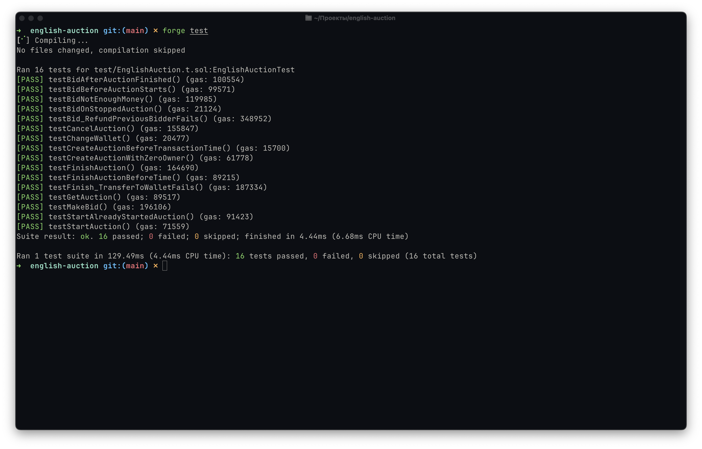

## Английский аукцион

Тип аукциона, где торги начинаются с минимальной базовой стоимости. Участники, при этом, пошагово повышают цену на лот.

**Победителем** считается тот участник, что предложил самую высокую ставку за лот до окончания времени аукциона.

В данном репозитории представлен код смарт-контракта, реализующего английский аукцион. Код смарт-контракта покрыт тестами с помощью фреймворка [Foundry](https://getfoundry.sh).

## Тесты

Ниже представлен алгоритм запуска тестов для смарт-контракта локально.

1. Установка `Foundry`

```shell
curl -L https://foundry.paradigm.xyz | bash
source ~/.zshenv
foundryup
```

2. Скачивание репозитория

```shell
git@github.com:wariazait/english-auction.git
cd english-auction
```

3. Запуск тестов

```shell
forge test
```

Возможный результат запуска тестов будет выглядеть следующим образом:


